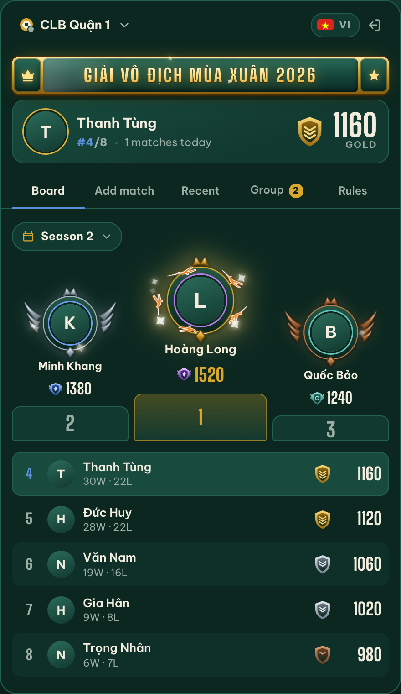
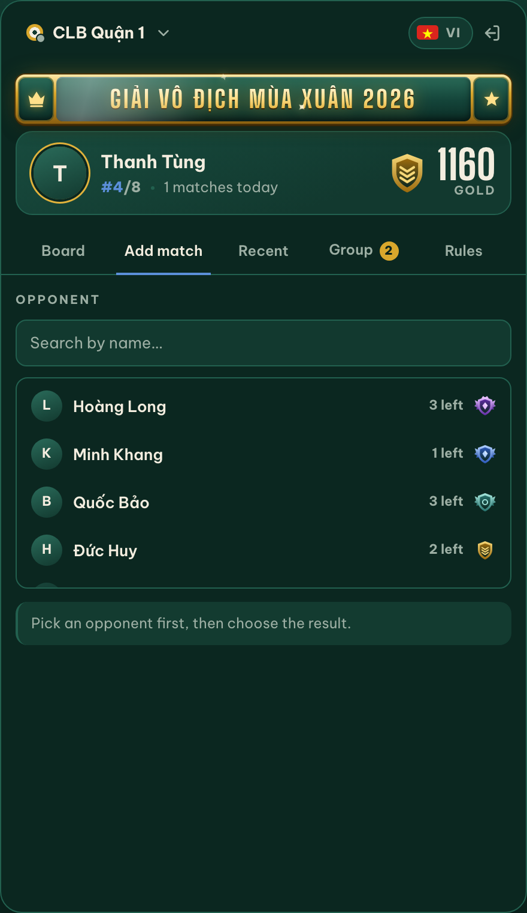
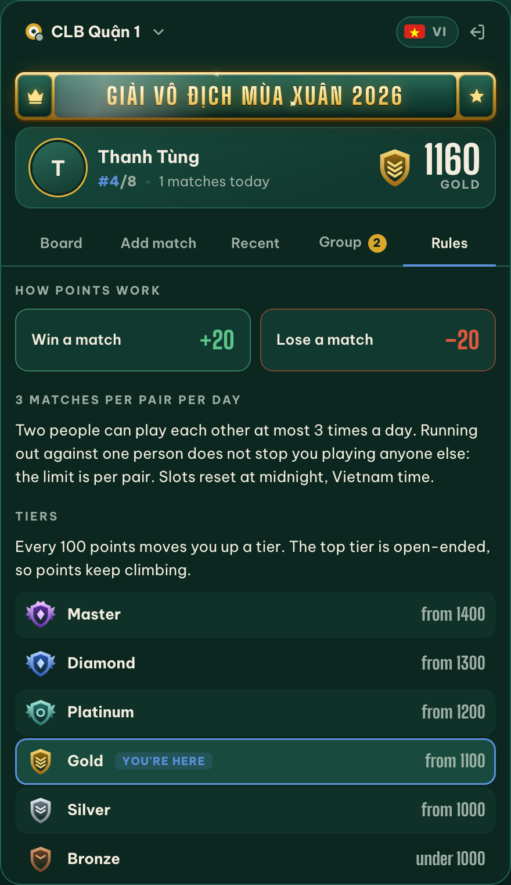

# Bậc Thang

[](https://github.com/chicongst/bacthang/actions/workflows/ci.yml)
[](LICENSE)


*Bậc thang* is Vietnamese for a step on a staircase, which is what this is: a scoring and
rank-climbing board for a group that competes at something: billiards, badminton, chess,
board games, anything. It runs as a web app and people sign in with Discord.

| Board | Add match | Rules |
|---|---|---|
|  |  |  |

Each group is its own **workspace** with its own board. After signing in you search for a workspace to
join or create one, and whoever creates it owns it. One account can belong to several workspaces and
switch between them inside the app.

Scoring: everyone starts at **1000** points, a win is **+20**, a loss is **-20**, and a pair of players
can record at most **3 matches against each other per day** (Vietnam time).

Every **100 points** moves you up a tier: Bronze (under 1000), Silver, Gold (1100), Platinum (1200),
Diamond (1300), Master (1400 and up). The top tier is open-ended and always shows the score next to it.

The limit is counted **per pair, not per person**. A and B can play each other three times a day, and
A against C has its own budget. Counting per person would let two heavy rivals use up each other's day
and block everyone else.

Points are tied to the pair (workspace, player) and **are never reset by leaving**. Leave a workspace and
come back and the old score is still there, negative or not.

The owner can end a **season**, which files the final table away and starts everyone at 1000 again. The
matches are not deleted: every past season stays readable from the board.

The board updates **live**: when someone records a match, the ranking changes on everyone's screen
without a reload. A small dot next to the workspace name turns green while the stream is connected.

The interface ships in **English and Vietnamese**, switched with a flag button. Add `?lang=en` or
`?lang=vi` to a link to open it in a chosen language.

Results can also be recorded **from Discord** with `/win` and `/loss`, with `/board` and `/me` to read
the standings. The bot answers in whichever of the two languages the player's Discord is set to, and a
match recorded in chat shows up on everyone's board straight away, because it travels the same path as
the website. It is optional: an instance with no Discord application configured simply does not serve
it.

| Workspace mode | How people get in |
|---|---|
| Public | Anyone who finds it in search joins straight away |
| Private | Search still finds it, but joining sends a request the owner approves |

The owner approves or declines requests, removes members, deletes a wrongly recorded match (both
players get their points back), renames the workspace and flips it between public and private. Someone
the owner removed has to ask again to return, even in a public workspace.

## Deploying

One command, to any server you can SSH into:

```bash
./deploy.sh root@198.51.100.10                  # name the host
echo 'root@198.51.100.10' > .deploy-host        # or save it once, git ignores this file
./deploy.sh
```

It copies the source to `/opt/ranking`, installs Docker if the server has none, dumps the database to
`/var/backups/ranking` before touching anything, rebuilds the containers and waits for `/api/health` to
answer. The first run copies `deploy/.env.example` into place and stops so you can fill it in.

**No domain yet?** Point `API_DOMAIN` at `<your-ip>.sslip.io`. `sslip.io` resolves any hostname
containing an IP back to that IP, so Caddy can obtain a real Let's Encrypt certificate for a bare
server. When you do buy a domain, point an A record at the server, change `API_DOMAIN` and redeploy.

## Layout

One npm workspace, one lockfile, one install:

```
packages/
  app/        The UI, framed by a shell but unaware of it
  server/     API: Node.js, Fastify, Drizzle, PostgreSQL
  web/        The shell: sign-in by page redirect, session in localStorage, responsive frame
deploy/       Docker Compose for the VPS, with Caddy handling HTTPS
deploy.sh     One-command deploy to a server
```

`packages/app/` is a package of its own rather than a folder the shell reaches into, which is what keeps a
single copy of React in the bundle: two copies break hooks, and before the workspace existed the
Vite config had to pin the copy by hand.

Everything the host provides reaches the UI through one `Platform` interface, which is how the UI
stays testable against a fake platform and how it once ran unchanged inside a Chrome extension.

| Document | What it covers |
|---|---|
| [`CONTRIBUTING.md`](CONTRIBUTING.md) | How to set up, what the checks are, what a good change looks like |
| [`SECURITY.md`](SECURITY.md) | Threat model, design decisions, accepted risks, how to report |
| [`CLAUDE.md`](CLAUDE.md) | Repository conventions |
| [`FrontendAgents.md`](FrontendAgents.md) | Front-end conventions for `packages/app/` and `packages/web/` |
| [`.claude/`](.claude/README.md) | Guardrails that hold an AI assistant to the two files above |
| [`docs/AUDIT.md`](docs/AUDIT.md) | A 20-dimension quality scorecard, before and after |
| [`docs/plans/`](docs/plans) | The design notes the project was built from |
| [`packages/server/openapi.json`](packages/server/openapi.json) | The API, generated from the route schemas and checked in CI |

The running API serves the same spec as a browsable page at `/docs`.

The privacy policy is served at `/privacy.html`, with its source in `packages/web/public/privacy.html`.

## Setting up your own instance

### 1. Create a Discord application

1. Go to <https://discord.com/developers/applications> and create one.
2. On the **OAuth2** tab: copy the **Client ID**, reset and copy the **Client Secret** (this one only
   ever goes into `.env` on the server), then add your redirect URIs under **Redirects**:
   `https://<your domain>/`, with the trailing slash, which Discord matches exactly.

### 2. Bring up the server

You need a VPS with Docker and a domain (or subdomain) whose A record points at it, with ports 80 and
443 open.

```bash
cd ranking/deploy
cp .env.example .env
nano .env          # API_DOMAIN, POSTGRES_PASSWORD, DISCORD_*, ADMIN_DISCORD_IDS
docker compose up -d --build
curl https://<API_DOMAIN>/api/health     # {"ok":true}
```

Caddy needs about half a minute on first boot to obtain a certificate. The API applies its
migrations from `packages/server/drizzle/` on startup, so there is no separate migration step.

Pre-built images are published to `ghcr.io/chicongst/bacthang/api` and `.../web` on every push
to `main`, for both amd64 and arm64, if you would rather not build on the server.

`ADMIN_DISCORD_IDS` is a **server admin** list, not a workspace owner list: anyone in it has owner
rights in every workspace, which is there for cleanup. Leaving it empty is fine since each workspace
already has an owner. To find your ID, turn on Developer Mode in Discord, right-click your name and
copy the user ID. Separate several with commas and run `docker compose up -d` to apply.

### 3. Turn on the slash commands (optional)

On the same Discord application:

1. **General Information** tab: copy the **Application ID** and the **Public Key** into `DISCORD_APP_ID`
   and `DISCORD_PUBLIC_KEY` in `deploy/.env`, and set the **Interactions Endpoint URL** to
   `https://<API_DOMAIN>/api/discord/interactions`. Discord verifies the endpoint the moment you save,
   so bring the server up first.
2. **Bot** tab: create a bot and copy its token into `DISCORD_BOT_TOKEN`.
3. Register the commands once, from a machine with the repository checked out:

   ```bash
   cd ranking/server
   DISCORD_APP_ID=... DISCORD_BOT_TOKEN=... npm run discord:register
   ```

4. **Installation** tab: add the application to your Discord server with the `applications.commands`
   scope.

Players use the bot as themselves: it matches their Discord account to the one they already signed in
with on the website, so there is nothing to link and no extra password. Someone who has never signed in
gets a one-line reply pointing at the sign-in page. Every request Discord sends is verified against the
public key and rejected if it is more than five minutes old.

`/win` and `/loss` answer in the channel, so the opponent and the rest of the group see the result.
`/board` and `/me` answer privately to whoever asked.

## Development

Install once at the root and every workspace is ready:

```bash
npm install
npm run typecheck      # every workspace
npm test               # every workspace
```

The server tests want a database; the UI tests do not:

```bash
npm run db:test        # Postgres for tests, in Docker, on port 54329
npm run test:coverage  # 131 server tests: scoring rules, daily limits, concurrent writes,
                       #   sign-in, session revocation, workspace isolation, seasons,
                       #   the event stream, the Discord endpoint
npm run openapi        # regenerate packages/server/openapi.json after a route change
docker stop bacthang-testdb
```

```bash
npm run --workspace bacthang-web test   # 18 tests: i18n, recording a match, the shell, the banner
npm run e2e                             # 11 Playwright checks in a real browser, desktop and phone
```

Any workspace script also runs the usual way from inside its own directory.

The Playwright suite runs against sample data, so it needs no database and no Discord app. It
catches what jsdom cannot: a broken bundle, a CSS rule that hides a control, a page that scrolls
sideways on a phone.

To browse the UI on sample data, with no server and no Discord, start the shell with
`npm run dev:web` from the root and open:

| Screen | URL |
|---|---|
| Leaderboard | `http://localhost:5173/?mock` |
| Record a match | `http://localhost:5173/?mock&tab=record` |
| Recent matches | `http://localhost:5173/?mock&tab=recent` |
| Group management | `http://localhost:5173/?mock&tab=group` |
| Pick a workspace | `http://localhost:5173/?mock&view=workspaces` |
| Sign in | `http://localhost:5173/?mock&view=login` |

More screenshots are in [`docs/screenshots/`](docs/screenshots): the group tab, recent matches, the
workspace picker, sign-in, and the same board on a phone. Sample data and the `?mock` switches never
reach a build.

## Contributing

Read [`CLAUDE.md`](CLAUDE.md) before changing code, and
[`FrontendAgents.md`](FrontendAgents.md) as well before touching `packages/app/` or `packages/web/`. The
rule that surprises people most: **do not write comments that retell what the code does**, only ones
that explain a trick, an outside constraint, a trade-off or a business reason.

## License

MIT, see [`LICENSE`](LICENSE).
